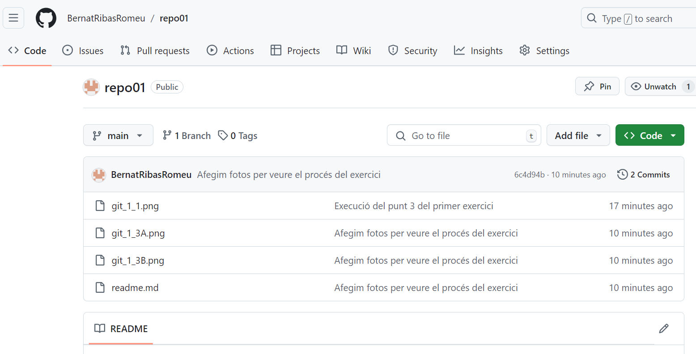

**1.1**  
Creem el directori repo01 amb la ordre "mkdir" des del escriptori, un cop fet això, volem inicialitzar el repositori local amb l'ordre "git init repo01/" i veurem que es crea una carpeta oculta anomenada .git, si aquesta carpeta esta dins de repo01 confirma que hem convertit la carpeta repo01 en un repositori local.  

**1.2**  
Ja tenim el readme.md creat amb aquesta explicació i les seguents que anirem afegint. 

**1.3**  
Preparem amb l'ordre "git add ." passem tots els arxius a la stage area per preparar-nos per executar l'ordre "git commit -m" afegint entre cometes un comentari pel registre.  

  

  

**1.4 i 1.5**  
Al executar l'ordre "git push" ens salta un error ja que no tenim el repositori local binculat a un remot, per tant haurem de crear un remot i conectar-lo amb el link corresponent.  
Abans de crear el repositori remot hauriem d'haber executat l'ordre "git remote -v" que ens informa pel terminal el link al repositori remot amb el que estem treballant.  

**1.6**  
Per poder continuar, hem de treballar amb [GitHub](http://www.github.com) per crear el repositori remot i obtenir els links per bincular el local amb el remot, a més podrem configurar el remot amb diferents opcions per ajustar-lo a les nostres necessitats.  

  

**1.7**  
Ara si, executem l'ordre "git remote -v" i veiem al terminal els links del repositori remot amb el que estem treballant.  

  

**1.8**  
Afegim els últims canvis al repositori remot per garantitzar que tenim l'última versió disponible per poder treballar des de altres dispositius o per donar accés a d'altres programadors.  

  

**1.9**  
Al actualitzar el nostre repositori remot [/repo01](https://github.com/BernatRibasRomeu/repo01) veiem que tenim totes les imatges i l'última versió del readme.md, a més tenim un registre de tots els commit que hem anat fent durant el procés.  

  
En aquesta imatge veiem tots els arxius del repositori remot.  

  
En aquesta imatge veiem el registre de "commits", qui els ha fet i quan.