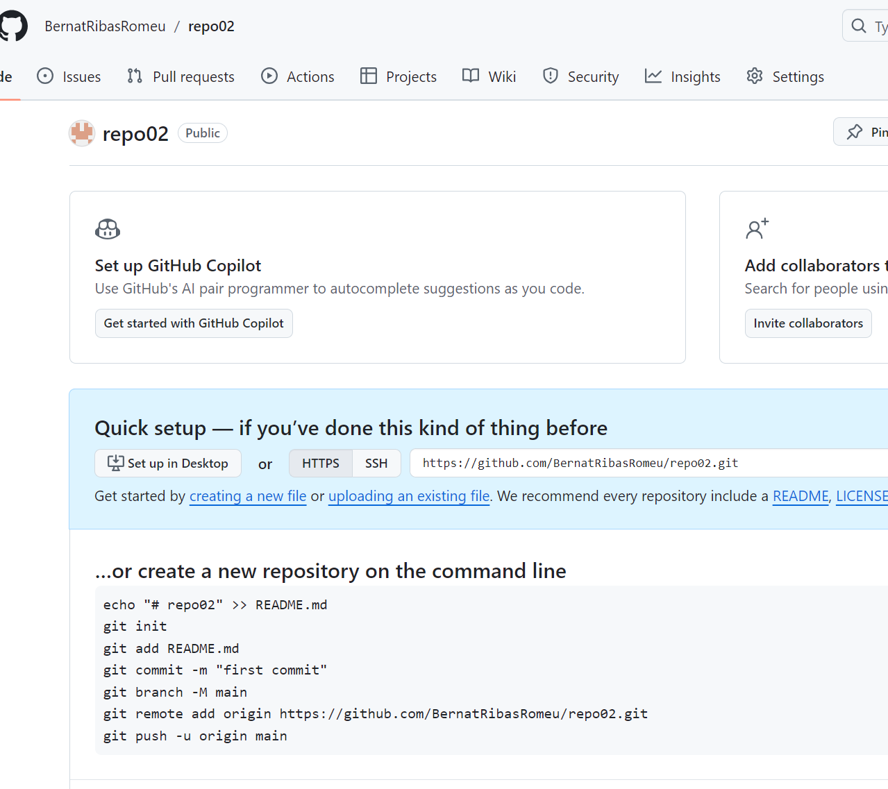
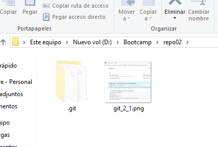
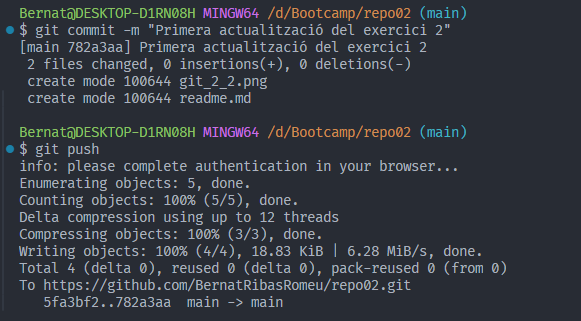
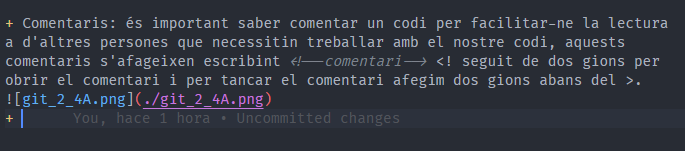
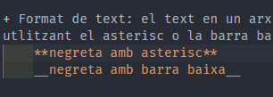
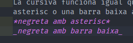
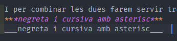
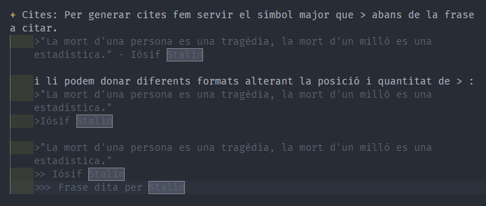

## Exercici 2  
#### **2.1**  
Al crear un repositori des de [el meu GitHub](https://github.com/BernatRibasRomeu) estem creant un repositori remot.

  

#### **2.2**  
Si volem copiar aquest repositori al nostre dispositiu, cal copiar el link proporcionar per GitHub [Repo02](https://github.com/BernatRibasRomeu/repo02.git) a la terminat de Git Bash, utilitzant l'ordre "git clone link", això crearà una copia de la carpeta en el directori de la teva elecció ja amb el repositori local i tots els arxius que es trobin dins del repositori remot.  

  

#### **2.3**  
Ara crearem el arxiu readme.md per tal d'afegir la informació pertinent per a la resolució del exercici. Un cop tinguem una versió de la que estiguem satisfets, executarem l'ordre "git add ." per moure els arxius a la staging area, després amb l'ordre "git commit -m *petita descripció*" per enviar els arxius al repositori local on quedarà registrat qui ha fet la modificació i quan s'ha fet. I per acabar amb l'ordre "git push" enviarem les noves versión del repositori local al remot.

  

#### **2.4**  
En aquest apartat farem un recull de les principals opcions que tenim a l'hora de treballar amb Markdown.  

+ Primer tenim els encapçalaments que s'identifiquen amb el símbol # i en funció de la quantitat (de 1 a 6) podem determinar el tamany del encapçalament.  
    # Encabezado h1 
    ## Encabezado h2
    ### Encabezado h3
    #### Encabezado h4
    ##### Encabezado h5
    ###### Encabezado h6  

+ Salts de línia: per separar diferents línias o paragrafs afegirem 2 espais al final de la línia o text que volguem separar de la resta.  

+ Comentaris: és important saber comentar un codi per facilitar-ne la lectura a d'altres persones que necessitin treballar amb el nostre codi, aquests comentaris s'afageixen escribint <!--comentari--> <! seguit de dos gions per obrir el comentari i per tancar el comentari afegim dos gions abans del >.  
  

+ Format de text: el text en un arxiu .md es pot escriure en cursiva o negreta utlitzant el asterisc o la barra baixa:  
    **negreta amb asterisc**  
    __negreta amb barra baixa__  
      

    La cursiva funciona igual que la negreta però només farem servir un asterisc o una barra baixa a cada extrem del text en questió:  
    *cursiva amb asterisc*  
    _cursiva amb barra baixa_  

    

    I per combinar les dues farem servir tres simbols de cada:  
    ***negreta i cursiva amb asterisc***  
    ___negreta i cursiva amb asterisc___  
      

+ Cites: Per generar cites fem servir el símbol major que > abans de la frase a citar.
    >"La mort d'una persona es una tragèdia, la mort d'un milló es una estadística." - Iósif Stalin  

    i li podem donar diferents formats alterant la posició i quantitat de > :  
    >"La mort d'una persona es una tragèdia, la mort d'un milló es una estadística."  
    >Iósif Stalin  

    >"La mort d'una persona es una tragèdia, la mort d'un milló es una estadística."  
    >> Iósif Stalin  
    >>> Frase dita per Stalin  

  

+ Llistas: Amb els símbols *, +, - podem fer llistes. Cal tenir en compte que les llistes son diferents per cada símbol.
    + Item 1
    + Item 2
    * Item 3
    * Item 4
    - Item 5
    - Item 6  

    El espai entre llistes es diferent al canviar de símbol.  

+ Enllaços: també tenim l'opció d'afegir enllaços al nostre text utilitzant <>.  
    <http://www.google.com> Cal tenir en compte que l'enllaç ha de ser complert, amb les 3 v dobles i el prefix http://. Ara bé, també podem afegir un text i crear un hipervincle amb el enllaç. [Anar a Google](http://www.google.com) afegint el text entre [] i just després el enllaç entre ().  

+ 