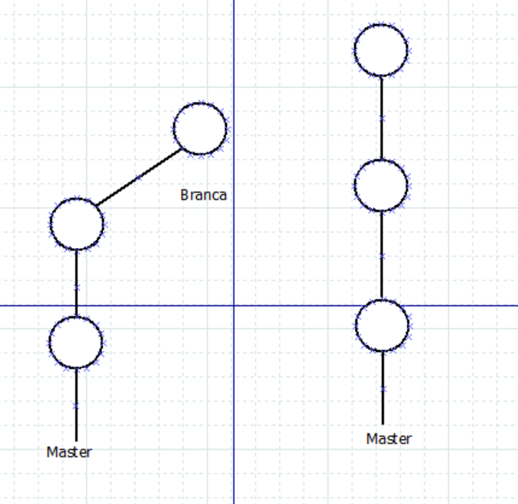
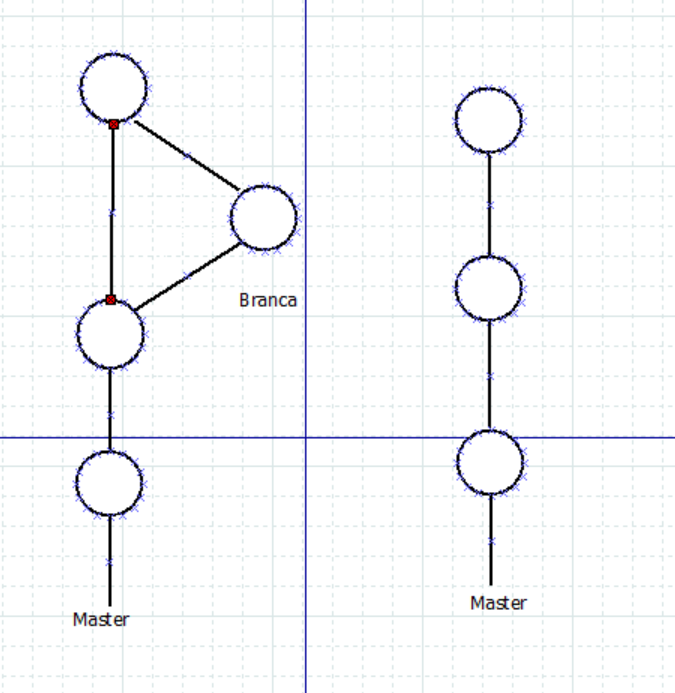

## Diferencies entre Fast Foraward i No Fast Forward  
La principal diferència entre el Fast Forward (FF) i el No Fast Forward (NFF) és la manera en que combinem les branques amb el main. Però, què vol dir això? Primer hem de coneixer com funciones els dos tipus de sistemes.  

El sistema FF agafa els commits de la branca i els ajunta a la principal de manera ràpida sense demanar un commit de confirmació. El repositori simplement adoptara els commits com si s'haguessin fet des del main.  

  

En aquesta imatge veiem el main amb una branca, quan fem el merge la bola (el commit) que està desplaçada s'afegeix al main i queda tot com una sola branca.  

En canvi el NFF et demana un commit de confirmació quan fas el merge per crear una "bola" d'unió per les branques com es veu en la següent iatmge:  

